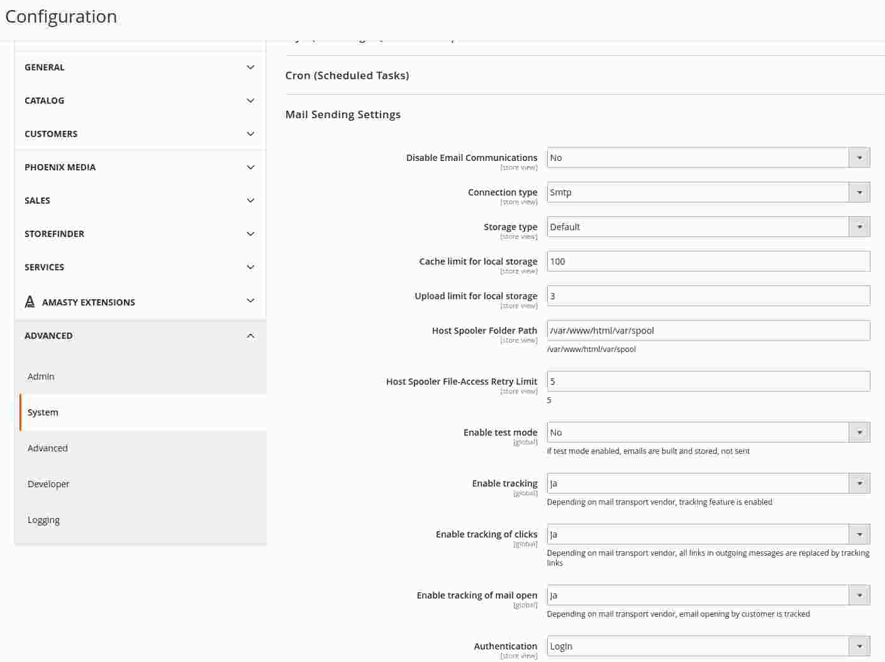

# Smtp extension for Magento 2 shockwavemk mail module

This module extends the capabilities of Magento 2 mailing by smtp
host configuration.

A new mail transport type is added to the system which takes care of transport
of outgoing mails to a mail service provider.

## Installation

Add the module to your composer file.

```json
{
  "require": {
    "shockwavemk/magento2-module-mail": "dev-master",
    "shockwavemk/magento2-module-mail-smtp": "dev-master"
  }
}

```

Install the module with composer.

```bash

    composer update

```

On succeed, install the module via bin/magento console.

```bash

    bin/magento cache:clean
    
    bin/magento module:enable Shockwavemk_Mail_Base
    
    bin/magento module:enable Shockwavemk_Mail_Smtp

    bin/magento setup:upgrade

```


## Features

### Mail sending over smtp

Transport and storeage configuration can be easily done via store config.
Installed plug-ins for transport and storeage can be selected at this point.



## Configuration

In Adminhtml/Backend via store config

Stores > Configuration > Advanced > System > Mail Sending Settings

it is possible to configure the follwing settings,
if "smtp" is selected in dropdown for "type" value.


- Host
- Port
- Authentication
- Username
- Password
- Ssl settings


### Attachment handling

The [base mail module](https://github.com/shockwavemk/magento2-module-mail) supports attachment sending.
Magento2 does not support native file attachment handling, therefore you need to
add some code on your own.
